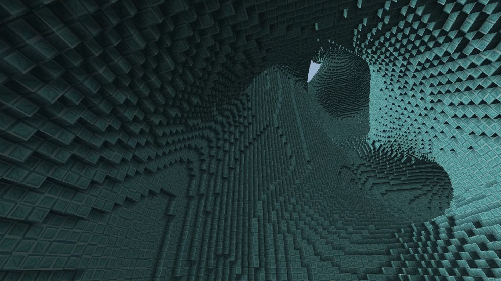
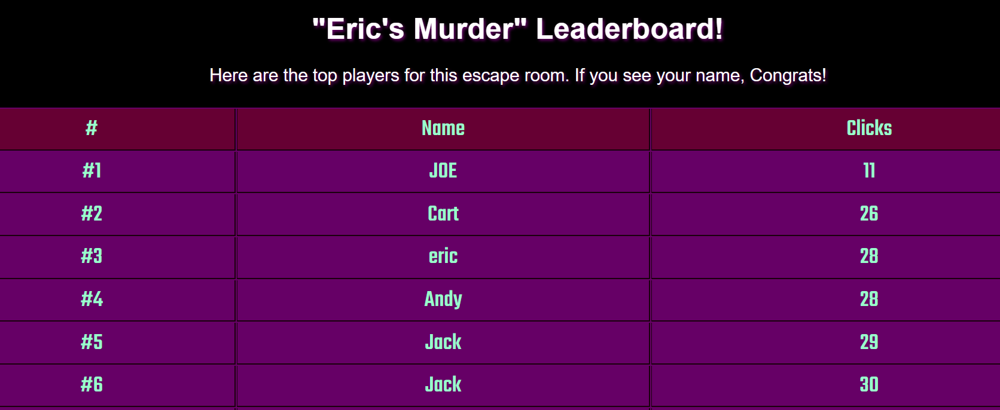

# Hi! Welcome to my portfolio. My name is Fiora.

Below is a list of my past projects organized by size.

---

🧊 [Voxel Renderer using Bit-Packing](https://github.com/fiora-nott/OpenGL-Bitpacking.git)  <C++, OpenGL>  

---

🖱️ [Live-Update Student Leaderboard](https://github.com/fiora-nott/GAS-Leaderboard.git)  <Javascript, Google Apps Script>

---

<!--
**fiora-nott/fiora-nott** is a ✨ _special_ ✨ repository because its `README.md` (this file) appears on your GitHub profile.

Here are some ideas to get you started:

- 🔭 I’m currently working on ...
- 🌱 I’m currently learning ...
- 👯 I’m looking to collaborate on ...
- 🤔 I’m looking for help with ...
- 💬 Ask me about ...
- 📫 How to reach me: ...
- 😄 Pronouns: ...
- ⚡ Fun fact: ...
-->
